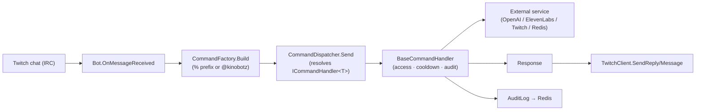

# Architecture

Kinobotz is a Twitch bot platform: a chat bot worker, a REST/realtime API, and a Vue dashboard,
all in this monorepo (`backend/` + `frontend/`), on **.NET 10** and Redis.

## Components

| Component | Project / path | Role |
|-----------|----------------|------|
| **Bot worker** | `backend/twitchBot` (`kinobotz` dyno) | Connects to Twitch IRC + events, dispatches chat commands, runs the token-refresh job |
| **Web API** | `backend/webapi` (`web` dyno) | REST API for the dashboard (JWT auth) + SignalR `/overlayHub` for overlay audio |
| **Infrastructure** | `backend/Infrastructure` | Redis repositories, the GPT chat service (`Microsoft.Extensions.AI`), JWT, overlay hub |
| **Entities** | `backend/Entities` | Shared domain models (`BotConnection`, `Command`, `AuditLog`, …) |
| **Dashboard** | `frontend/` | Vue 3 SPA (Twitch OAuth → JWT) for config, stats, GPT behaviors, and the TTS overlay |

## Command flow (chat → response)

Commands are plain `ICommandHandler<TCommand>` resolved from DI by the `CommandDispatcher`
(MediatR was removed). `BaseCommandHandler` wraps each with the existence/enabled check,
access-level gate, cooldown, and audit logging.

## Realtime + dashboard

- **Overlay audio:** `%tts` → `IGptChatService`/ElevenLabs produces audio → the bot relays it to
  the API, which broadcasts it over SignalR `/overlayHub` to the browser overlay (`OverlayApp`).
- **Dashboard:** Vue app → Twitch OAuth → `POST /twitch/login` → JWT → REST calls
  (`/botconnection`, `/commands`, `/public/gptBehaviors`, …).

## Integrations

- **Twitch** — IRC (chat, via TwitchLib), Helix (clips, channel title, follows), PubSub
  (bits, subs, stream up/down, channel points). *PubSub → EventSub migration is a future phase.*
- **OpenAI** — `Microsoft.Extensions.AI` `IChatClient` behind `IGptChatService` (quota circuit-breaker).
- **ElevenLabs** — text-to-speech.
- **Discord** — webhooks for clips / TTS audio.
- **Redis** — the only datastore (cache + system-of-record). See [redis-key-schema.md](redis-key-schema.md).

## Data & deployment

- **Data:** Redis only (free Redis Cloud add-on); System.Text.Json serialization.
- **Deployment:** backend auto-deploys from `main` (Heroku GitHub integration, container stack);
  UI deploys via GitHub Actions. Full detail in [deployment-and-ops.md](deployment-and-ops.md).

## Local development

- **Backend:** `dotnet build backend/twitchBot.sln`; `dotnet test backend/twitchBot.sln`.
  Config via environment / `.env` (see `.env_example`): Twitch client id/secret, bot tokens,
  `redis_host`/`redis_password`, `jwt`, `OPENAI_API_KEY`, `ELEVEN_LABS_API_KEY`.
- **Frontend:** in `frontend/`, `npm ci` then `npm run serve` (dev) / `npm run build`.
  Runtime config (`API_URL`, Twitch client id, redirect URI) is injected via `config.js`.

See also: [commands.md](commands.md) · [deployment-and-ops.md](deployment-and-ops.md) · [redis-key-schema.md](redis-key-schema.md).
